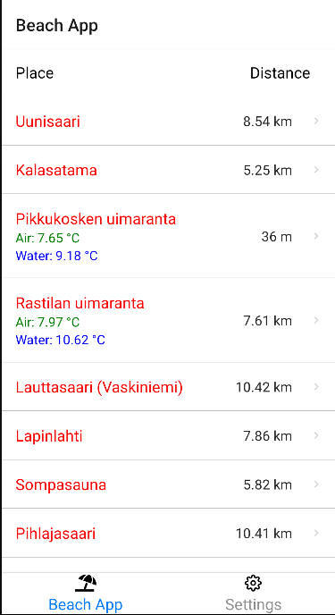
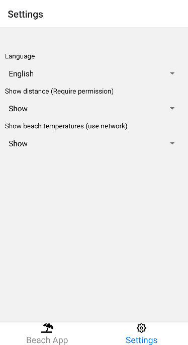

# Beach App 
Beach App on mobiilisovellus, joka listaa helsingin rantoja. Sovelluksen avulla voi tarkistaa: miten kaukana rannat ovat käyttäjästä ja osassa rannoista on myös saatavilla veden- ja ilmanlämpötilat. 

## Ominaisuudet

- Lista rannoista
- Etäisyys käyttäjästä rantaan (vaatii sijaintiluvan käyttäjältä)
- Ilman- ja vedenlämpötilat (vain osassa rantoja, käyttää mobiilikaistaa)
- Kielet: Suomi, Englanti
- Kartta sijantia varten

## Riippuvuudet
```json
  "dependencies": {
    "@react-native-async-storage/async-storage": "~1.15.0",
    "@react-native-picker/picker": "2.2.1",
    "@react-navigation/bottom-tabs": "^6.3.1",
    "@react-navigation/native": "^6.0.10",
    "@react-navigation/native-stack": "^6.6.1",
    "@rneui/base": "^4.0.0-rc.1",
    "@rneui/themed": "^4.0.0-rc.1",
    "expo": "~44.0.0",
    "expo-localization": "~12.0.0",
    "expo-location": "~14.0.1",
    "expo-status-bar": "~1.2.0",
    "geolib": "^3.3.3",
    "i18next": "^21.6.16",
    "react": "17.0.1",
    "react-dom": "17.0.1",
    "react-i18next": "^11.16.6",
    "react-native": "0.64.3",
    "react-native-localize": "^2.2.1",
    "react-native-maps": "0.29.4",
    "react-native-safe-area-context": "3.3.2",
    "react-native-screens": "~3.10.1",
    "react-native-web": "0.17.1"
  },
  ```
- Expo-localization hakee käyttäjän puhelimen käyttökielen
- Expo-location hakee käyttäjän sijainnin
- Geolib laskee etäisyydet käyttäjästä rantaan
- i18next lisää monikielisyyden
- Async-Storage tallentaa sovelluksen asetukset ja rantojen lämpötilat välimuistiin (hakee vain 15min välein internetistä)
- rneui (react-native-elements) listan tyylittelyyn

## Kuvia

<details><summary>Oletus näkymä</summary>



</details>

<details><summary>Karttanäkymä</summary>


</details>

<details><summary>Asetukset</summary>



</details>


## Lämpötilojen lähde

 [Veden reaaliaikainen lämpötila pääkaupunkiseudun uimarannoilla](https://hri.fi/data/fi/dataset/veden-reaaliaikainen-lampotila-helsingin-uimarannoilla). Aineiston ylläpitäjä on Forum Virium Helsinki Oy. Aineisto on ladattu [Helsinki Region Infoshare](https://hri.fi/) -palvelusta 11.05.2022 lisenssillä [Creative Commons Attribution 4.0](https://creativecommons.org/licenses/by/4.0/).